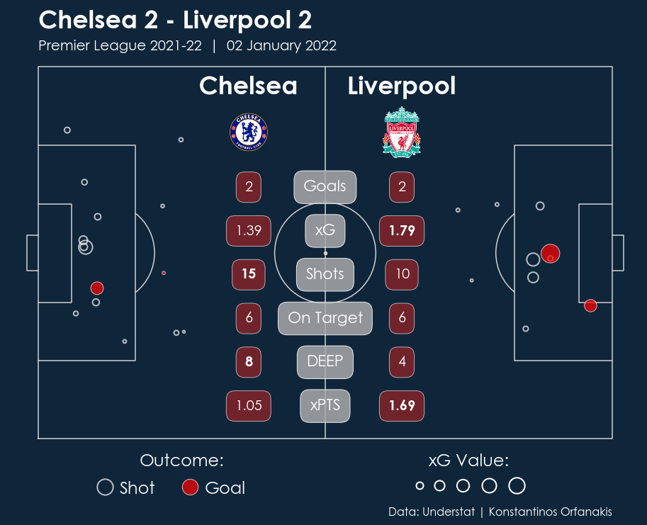

# Football Match Summary Report ⚽📈

  

  <em>Match report for the game between Chelsea and Liverpool that took place on the 2nd of January, 2022.</em>

 

# Overview

This repository contains Python code for:
- Web scraping a football match from [Understat](https://understat.com/), and
- Creating a figure that summarises that particular match.
Specifically, the final figure displays various stats (e.g. goals, shots, shots on target, xG, etc.) on top of a shot map for both the home and away teams.

For now, we are limited to matches from the English Premier League. 
However, we can easily expand to other leagues by adding a few lines of code and including the crests for the additional teams in the designated folder. 

 

# Code Organisation

The code is organised into three different Python scripts:
-	[`draw_football_pitch.py`](https://github.com/KOrfanakis/Football_Match_Summary_Report/blob/main/draw_football_pitch.py): As the name suggests, this file contains a function for visualising a football pitch.
It is extracted from the article ‘[How to Draw a Football Pitch](http://petermckeever.com/2020/10/how-to-draw-a-football-pitch/)’ by McKeever (accessed 17-01-2022).
The only modification is not showing the two penalty spots as they can easily get confused with missed shots in the final figure.

- [`match_scraper.py`](https://github.com/KOrfanakis/Football_Match_Summary_Report/blob/main/match_scraper.py): The second file contains a collection of functions 
for extracting the data (shots and goals) and various information used for the final figure (e.g. stat summary, headline, date, etc.).

- [`match_visualisation.py`](https://github.com/KOrfanakis/Football_Match_Summary_Report/blob/main/match_visualisation.py): The final Python file contains the function (`create_figure()`) for creating the figure.
Notice that the function requires three arguments: the ID of the game we want to visualise and the figure and axes objects of the plot.

The repository also contains a [Jupyter notebook]( https://github.com/KOrfanakis/Football_Match_Summary_Report/blob/main/Example_Notebook.ipynb) that demonstrates how to run the code and create the figure.
Also, please refer to my [Kaggle notebook]( https://www.kaggle.com/korfanakis/football-game-summary-web-scraping-understat ) for a better walkthrough of the code. 

 

# Requirements

Python Version: 3.6.8  
Packages: numpy (1.19.5), pandas (1.1.5), matplotlib (3.3.4), json (2.0.9), requests (2.25.1), bs4 (4.9.3).

 

# Acknowledgements

All data used in this tutorial are extracted from [Understat](https://understat.com/)'s website. 
The final design of our figure has been influenced by various sources such as [The Analyst](https://theanalyst.com/eu/) (for example, see [this tweet](https://twitter.com/OptaAnalyst/status/1480486161491664901/photo/1)), [Stats Perform](https://o7dkx1gd2bwwexip1qwjpplu-wpengine.netdna-ssl.com/wp-content/uploads/2020/11/Total-Shots-For-and-Against-Beerschot.png), and [Sport24.gr](https://www.sport24.gr/football/zoze-sa-o-thriamvos-ton-analytics.9482938.html)

 

# Extra Resources

[1] [How to Draw a Football Pitch](http://petermckeever.com/2020/10/how-to-draw-a-football-pitch/) by Peter McKeever (Accessed: 17/01/2022)

[2] [Shot Maps](https://github.com/mckayjohns/Viz-Templates/blob/master/code/shotmaps.ipynb) by McKay Johns (Accessed: 18/01/2022)

[3] [Understat Series : Shotmaps](https://www.kaggle.com/josegabrielgonzalez/understat-series-shotmaps) by José González (Accessed: 10/01/2022) 
